# GNUPlot Examples

Collection of [GNUPlot](http://www.gnuplot.info/) examples.

- [Default Line](#default-line)
- [Line Width 3](#line-width-3)
- [Line (1/100)](#line-1100)
- [Line Average](#line-average)
- [Line Sum](#line-sum)
- [Lines](#lines)
- [Points](#points)
- [Date](#date)
- [Time](#time)
- [DateTime](#datetime)
- [Headmap](#headmap)
- [Gantt](#gantt)
- [Y Error Bars](#y-error-bars)
- [Candlesticks](#candlesticks)
- [Timeline](#timeline)
- [Impulse](#impulse)
- [Histogram Clustered](#histogram-clustered)
- [Histogram Rowstacked](#histogram-rowstacked)

## Default Line

- GNUPlot script: [`scripts/line.gp`](scripts/line.gp)
- Data file: [`data/line.dat`](data/line.dat)

Using column 1 and 2 from `data/line.dat`.

	plot 'data/line.dat' using 1:2

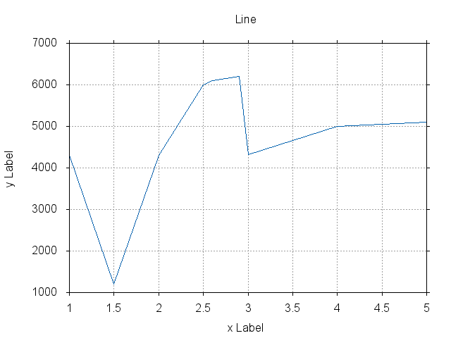

## Line Width 3

- GNUPlot script: [`scripts/line-width3.gp`](scripts/line-width3.gp)
- Data file: [`data/line.dat`](data/line.dat)

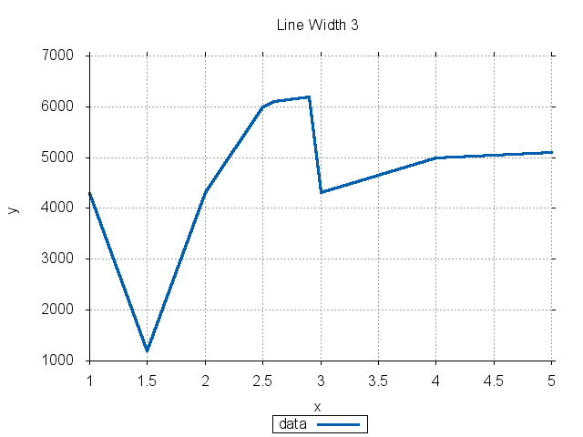

## Line (1/100)

- GNUPlot script: [`scripts/line-100.gp`](scripts/line-100.gp)
- Data file: [`data/line.dat`](data/line.dat)

Using the same as *Default Line* but scaling y with 1/100 of the original value.

	plot 'data/line.dat' using 1:($2/100)

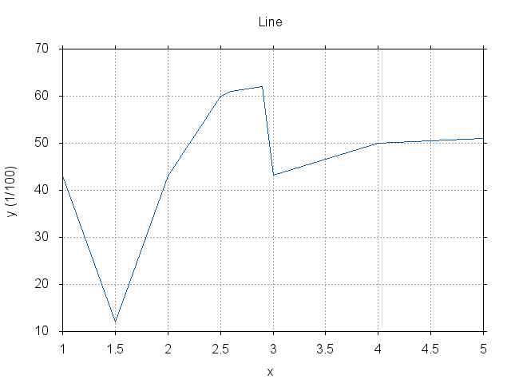

## Line Average

- GNUPlot script: [`scripts/line-avg.gp`](scripts/line-avg.gp)
- Data file: [`data/line-avg.dat`](data/line-avg.dat)

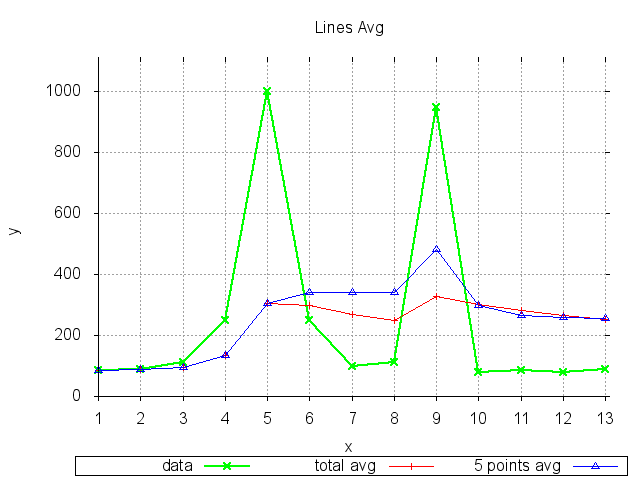

## Line Sum

- GNUPlot script: [`scripts/line-sum.gp`](scripts/line-sum.gp)
- Data file: [`data/line-sum.dat`](data/line-sum.dat)

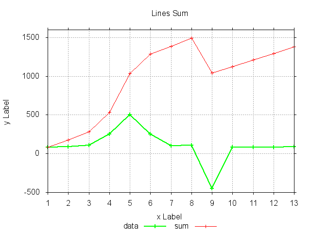

## Lines

- GNUPlot script: [`scripts/lines.gp`](scripts/lines.gp)
- Data file: [`data/lines.dat`](data/lines.dat)

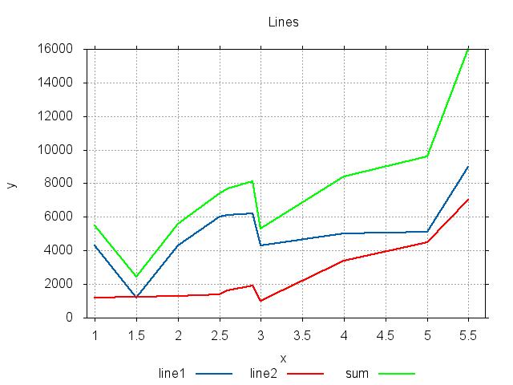

## Points

- GNUPlot script: [`scripts/points.gp`](scripts/points.gp)
- Data file: [`data/points.dat`](data/points.dat)

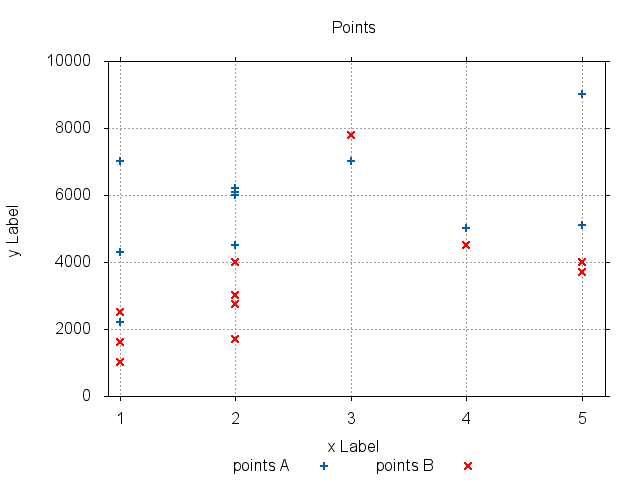

## Date

- GNUPlot script: [`scripts/date.gp`](scripts/date.gp)
- Data file: [`data/date.dat`](data/date.dat)

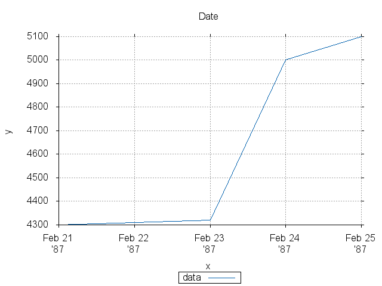

## Time

- GNUPlot script: [`scripts/time.gp`](scripts/time.gp)
- Data file: [`data/time.dat`](data/time.dat)

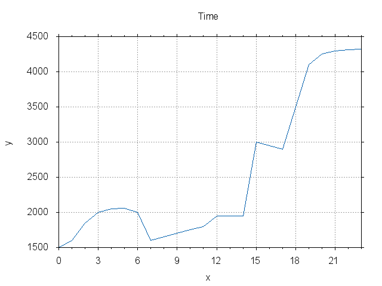

## DateTime

- GNUPlot script: [`scripts/datetime.gp`](scripts/datetime.gp)
- Data file: [`data/datetime.dat`](data/datetime.dat)

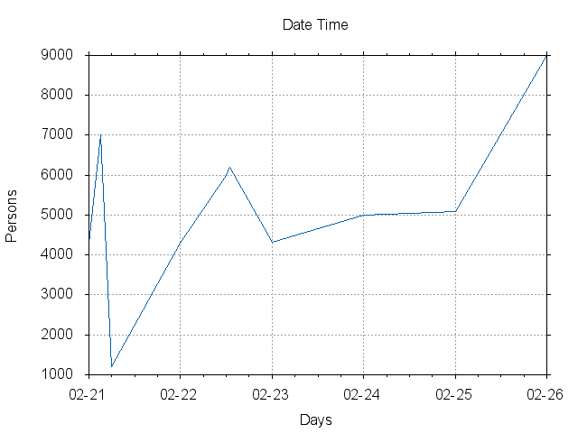

## Headmap

- GNUPlot script: [`scripts/headmap.gp`](scripts/headmap.gp)
- Data file: [`data/headmap.dat`](data/headmap.dat)

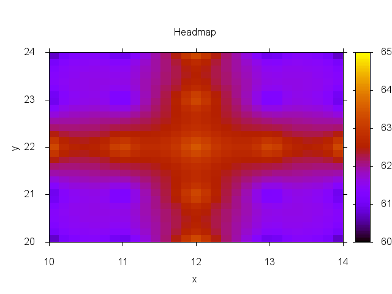

## Gantt

- GNUPlot script: [`scripts/gantt.gp`](scripts/gantt.gp)
- Data file: [`data/gantt.dat`](data/gantt.dat)

## Y Error Bars

- GNUPlot script: [`scripts/yerrorbars.gp`](scripts/yerrorbars.gp)
- Data file: [`data/yerrorbars.dat`](data/yerrorbars.dat)

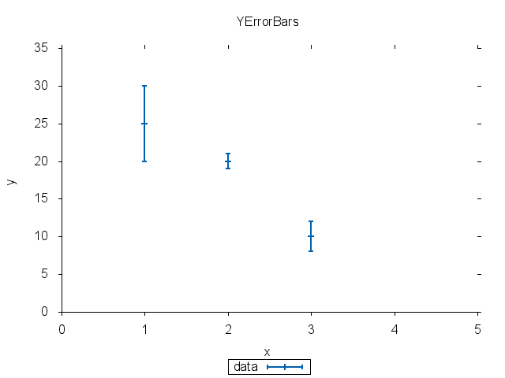

## Candlesticks

- GNUPlot script: [`scripts/candlesticks.gp`](scripts/candlesticks.gp)
- Data file: [`data/candlesticks.dat`](data/candlesticks.dat)

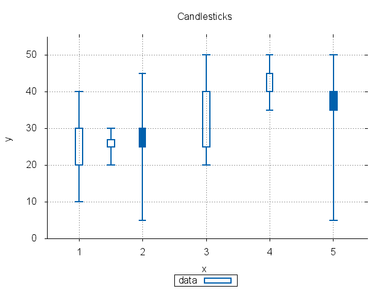

## Timeline

- GNUPlot script: [`scripts/timeline.gp`](scripts/timeline.gp)
- Data file: [`data/timeline.dat`](data/timeline.dat)

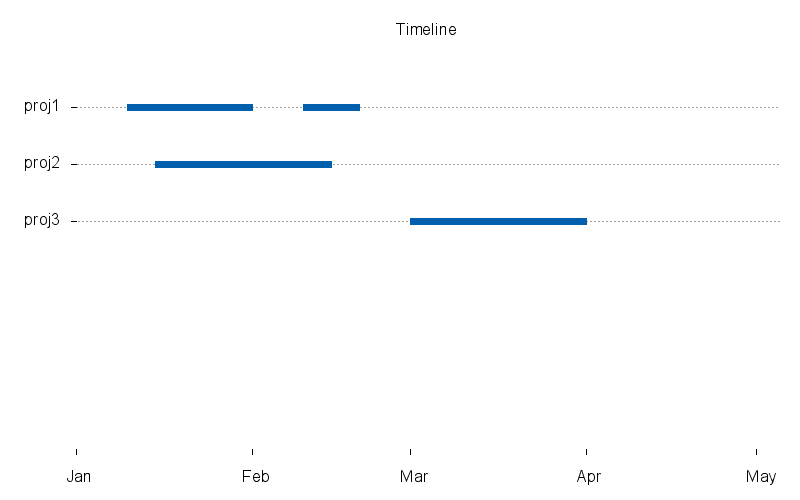

## Impulse

- GNUPlot script: [`scripts/impulse.gp`](scripts/impulse.gp)
- Data file: [`data/impulse.dat`](data/impulse.dat)

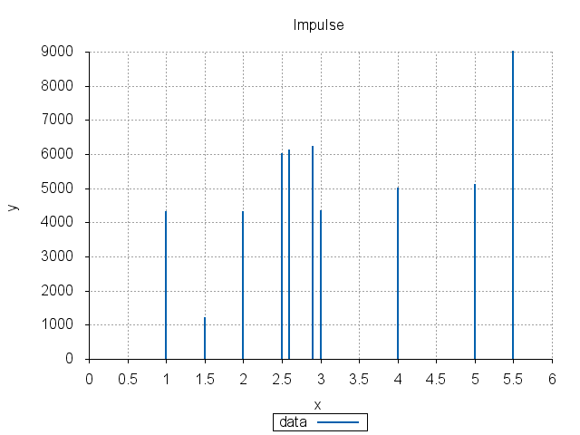

## Histogram Clustered

- GNUPlot script: [`scripts/histogram-clustered.gp`](scripts/histogram-clustered.gp)
- Data file: [`data/histogram-clustered.dat`](data/histogram-clustered.dat)

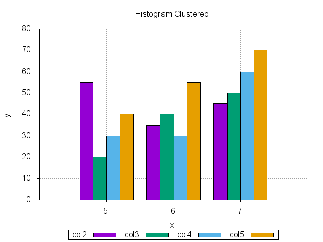

## Histogram Rowstacked

- GNUPlot script: [`scripts/histogram-rowstacked.gp`](scripts/histogram-rowstacked.gp)
- Data file: [`data/histogram-rowstacked.dat`](data/histogram-rowstacked.dat)

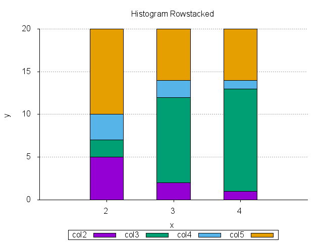
